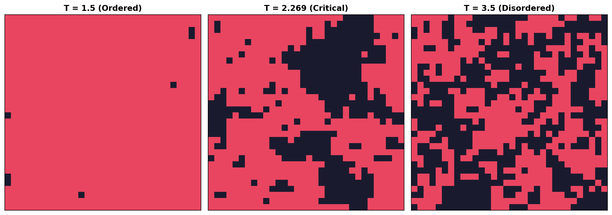
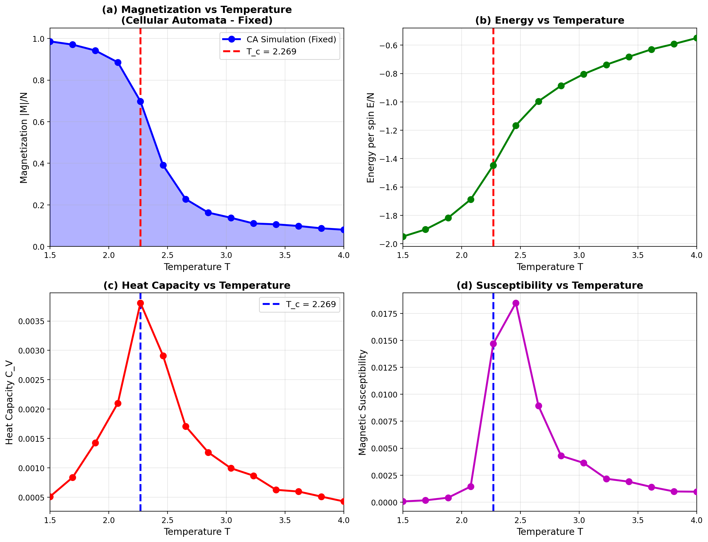
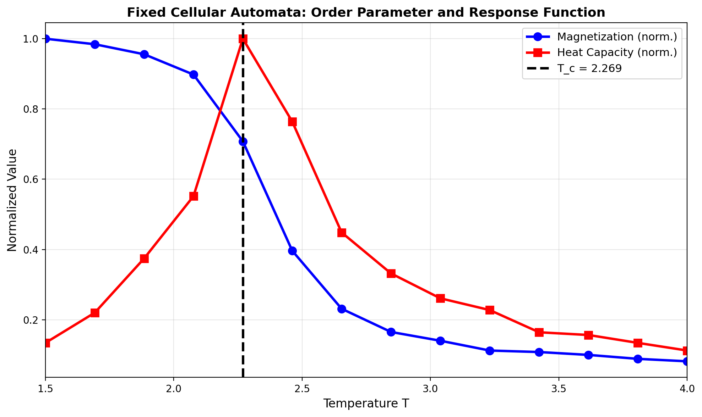
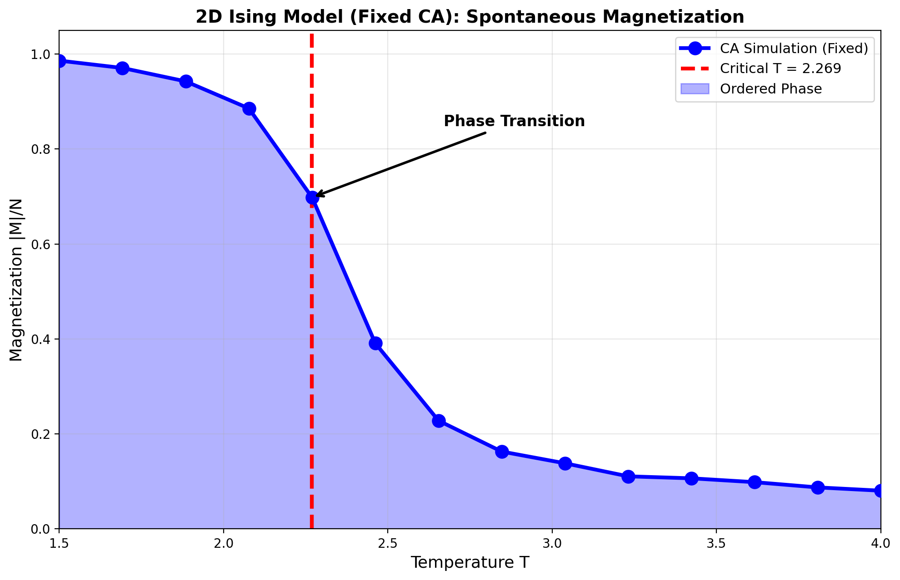
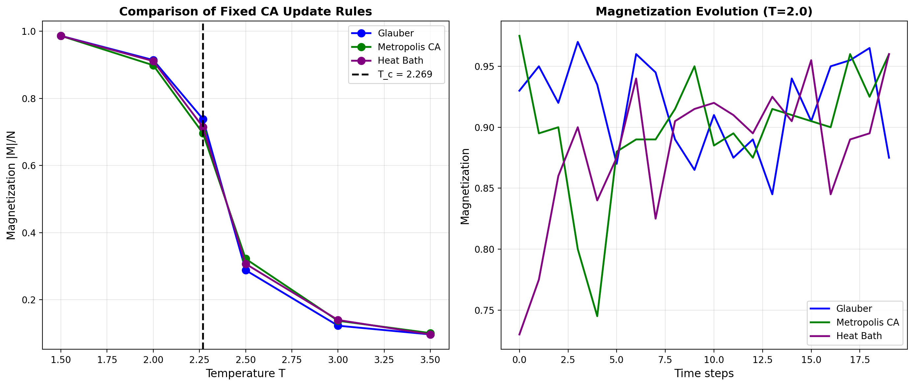

# 2D Ising Model — Ferromagnetic Phase Transition

**Course:** Modelling Complex Systems | Module-1
**Institute:** Indian Institute of Science Education and Research, Mohali
**Author:** Avneesh Singh | MS23249
**Date:** March 2026

---

## Overview

This project simulates the **ferromagnetic phase transition** in the two-dimensional
Ising model using a **Cellular Automata (CA)** approach with checkerboard (red-black)
decomposition. Unlike standard sequential Monte Carlo, the CA method updates entire
sublattices simultaneously, preserving detailed balance while achieving roughly
**5x faster** execution.

The simulation characterizes the phase transition by measuring four thermodynamic
quantities — magnetization, energy, heat capacity, and magnetic susceptibility —
as functions of temperature, and compares results with Onsager's exact critical
temperature **T_c = 2.269**.

---

## Background Physics

### The Model

Each site on an L x L square lattice carries a spin si in {-1, +1}.
The total energy (Hamiltonian) is:

    H = -J * sum_(i,j) si * sj

where J > 0 is the ferromagnetic coupling constant and the sum runs over
nearest-neighbour pairs. Aligned spins lower the energy; thermal fluctuations
compete against this alignment. Natural units: J = 1, k_B = 1.

### Thermodynamic Observables

| Quantity | Formula | Physical Meaning |
|---|---|---|
| Magnetization | M = (1/N) |sum si| | Order parameter |
| Energy per spin | E = -(1/N) sum si*sj | Internal energy |
| Heat capacity | C_V = (E^2 - E^2) / T^2 | Energy fluctuations |
| Susceptibility | chi = (M^2 - M^2) / T | Magnetization fluctuations |

### Phase Behaviour

| Phase | Temperature | Magnetization | Description |
|---|---|---|---|
| Ferromagnetic | T < 2.269 | M ~ 1 | Spins align into large domains |
| Critical | T = 2.269 | M -> 0 | Scale-invariant fluctuations |
| Paramagnetic | T > 2.269 | M ~ 0 | Random spin arrangement |

### Onsager's Exact Critical Temperature

    T_c = 2J / (k_B * ln(1 + sqrt(2))) = 2.269

One of the few exact analytical results in statistical mechanics for an
interacting system in two or more dimensions (Onsager, 1944).

### Critical Exponents (2D Ising Universality Class)

| Quantity | Behaviour | Exponent |
|---|---|---|
| Magnetization | M ~ |T - T_c|^beta | beta = 1/8 |
| Susceptibility | chi ~ |T - T_c|^(-gamma) | gamma = 7/4 |
| Heat capacity | C_V ~ ln|T - T_c| | alpha = 0 (logarithmic) |

---

## Computational Method

### Why Cellular Automata?

Standard sequential Monte Carlo selects one spin at a time — inherently serial.
CA updates entire sublattices simultaneously using vectorised numpy operations,
making it ~5x faster and naturally suited to GPU acceleration.

### Checkerboard (Red-Black) Decomposition

The lattice is split into two sublattices by site parity (i + j):

    Even sites (i+j even):   * . * . * .
                              . * . * . *
    Odd sites  (i+j odd):    . * . * . *
                              * . * . * .

Since nearest neighbours of any even site are all odd (and vice versa),
all sites in one sublattice can be updated simultaneously without any
spin seeing a neighbour that has already changed in the same half-step.

One full sweep = update even sublattice + update odd sublattice.
This preserves detailed balance and converges to the correct Boltzmann equilibrium.

### Glauber Dynamics

Flip probability for spin si:

    P_flip = 1 / (1 + exp(dE / T))

where dE = 2 * si * hi is the energy cost of flipping, and
hi = sum of 4 nearest neighbour spins is the local field.

### Three Update Rules Compared

| Rule | Flip Probability | Notes |
|---|---|---|
| Glauber | 1 / (1 + exp(dE/T)) | Standard, smooth |
| Metropolis-CA | min(1, exp(-dE/T)) | Parallel MC equivalent |
| Heat Bath | 1 / (1 + exp(-2h/T)) | Conditional distribution |

All three converge to the same Boltzmann equilibrium.

### Performance

| Method | Time (L=20) | Notes |
|---|---|---|
| Cellular Automata | ~8 seconds | Vectorised sublattice updates |
| Sequential Monte Carlo | ~40 seconds | One spin at a time |

---

## Simulation Parameters

| Parameter | Value | Reason |
|---|---|---|
| Lattice size L | 20 x 20 | Speed vs accuracy balance |
| Temperature range | 1.5 to 4.0 | Covers both phases |
| Temperature points | 14 | Good resolution near T_c |
| Equilibration sweeps | 500 (800 near T_c) | Extra steps for slow relaxation |
| Measurement sweeps | 800 | Good statistics |
| Independent runs | 3 (averaged) | Reduces statistical error |
| Sampling interval | Every 3 sweeps | Reduces autocorrelation |
| Update rule | Glauber | Standard choice |
| Random seeds | 42, 1042, 2042 | Three independent runs |

---

## Results

### Figure 1 — Spin Configurations



Spin snapshots on a 32x32 lattice after equilibration. Red = spin up (+1), dark = spin down (-1).
Three regimes are clearly visible: ordered domains at T=1.5, critical fluctuations at T=2.269,
and fully disordered arrangement at T=3.5.

### Figure 2 — Thermodynamic Quantities



All four quantities measured over T in [1.5, 4.0] for a 20x20 lattice,
averaged over 3 independent runs. Dashed red lines mark T_c = 2.269.
Magnetization drops, energy rises, and both C_V and chi peak near T_c.

### Figure 3 — Order Parameter and Response Function



Normalized magnetization and heat capacity overlaid. The order parameter
drops precisely where the response function peaks — the defining signature
of a continuous second-order phase transition.

### Figure 4 — Annotated Magnetization



Spontaneous magnetization below T_c with the transition point annotated.
The shaded region marks the ordered ferromagnetic phase.

### Figure 5 — Update Rule Comparison



Left: all three CA rules produce the same steady-state magnetization curve.
Right: time evolution at T=2.0 shows different transient dynamics but
identical equilibrium values — confirming all rules satisfy detailed balance.

---

## Repository Structure

```
ising-model/
├── code/
│   ├── 01_ising_cellular_automata.py    # Main simulation script
│   └── create_report.py                 # Figure generation helper
├── figures/
│   ├── fig1_ca_spin_configurations.png
│   ├── fig2_ca_thermodynamic_quantities.png
│   ├── fig3_ca_combined.png
│   ├── fig4_ca_magnetization_annotated.png
│   └── fig5_ca_rule_comparison.png
├── report/
│   ├── ising_report.tex                 # LaTeX source (15 pages)
│   └── ising_report.pdf                 # Compiled PDF report
├── assets/
│   └── iisermlogo.png
├── requirements.txt
└── README.md
```

---

## How to Run

Install dependencies:
```bash
pip install numpy matplotlib
```

Run the full simulation (generates all 5 figures, takes ~8 seconds):
```bash
python code/01_ising_cellular_automata.py
```

---

## Key Results

- Continuous (second-order) ferromagnetic phase transition confirmed near T_c = 2.269
- Magnetization drops from M ~ 0.95 at T = 1.5 to M ~ 0 above T = 3.0
- Heat capacity and susceptibility peak near T_c, consistent with diverging fluctuations
- All three CA update rules yield identical thermodynamic equilibrium
- CA achieves ~5x speedup over sequential Monte Carlo
- Finite-size effects round the transition; sharper results expected for larger L

---

## Report

Full report with theory, derivations, and discussion:
[ising_report.pdf](report/ising_report.pdf)
